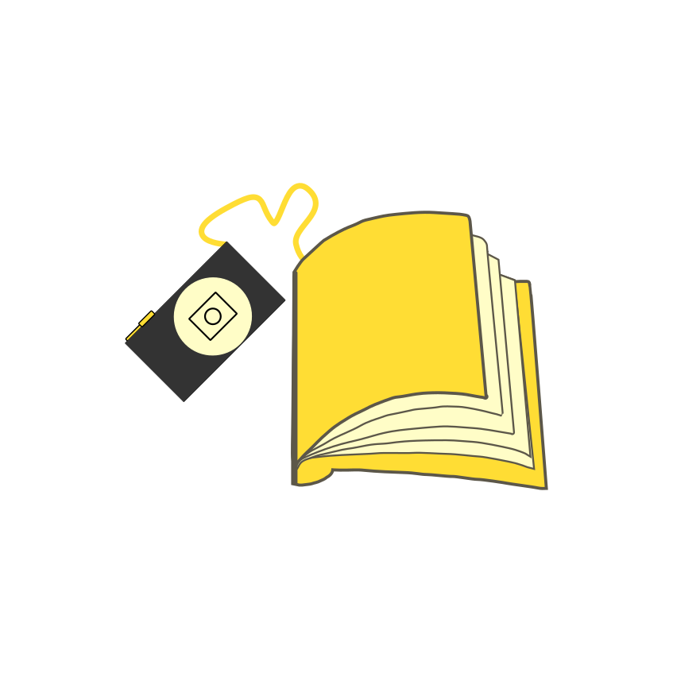

# $${\color{#F4C430}Knjiza}$$ 
  

$$
\textcolor{#F4C430}{Knjiza} \space
\textcolor{#5C5749}{-} \space
\textcolor{#F4C430}{Knji}\textcolor{#5C5749}{žni} \space
\textcolor{#F4C430}{za}\textcolor{#5C5749}{znamki,} \space
\textcolor{#F4C430}{za}\textcolor{#5C5749}{piski} \space
\textcolor{#5C5749}{in} \space
\textcolor{#5C5749}{citati}
$$
#

***Knjiza*** - knjižnji zaznamki, zapiski in citati je aplikacija, ki omogoča hranjenje zanimivih citatov in odlokom iz knjig.
Aplikacija ***Knjiza*** je nastala v okviru predmeta **TNUV** (Terminalske naprave in uporabniški vmesniki).
#
### Aplikacija omogoča 3 osnovne funkcionalosti:
#
#### Dodajanje citata ali odlmka
Aplikacija uporabi kamero da slika stran v knjigi in iz slike izlušči besedilo. Izberemo lahko željeni del besedili, ga popravimo in dopolnimo. 
Citat se shrani skupaj s podatki o avtorju in knjigi ter letu izzida knjige.
##
#### Dodajanje *"knjižnjega kazala"*
Aplikacija omogoča vnos naslova knjige in številke strani, ki jo lahko popravljamo.
##
#### Dodajanje prebrane knjige
Aplikacija omogoča, da vnesemo naslov in avtorja prebrane knjige.
##

  

